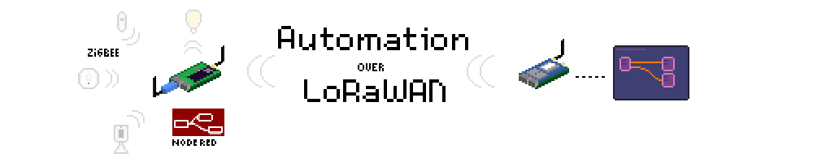

# LoRaBridge Documentation

LoRaBridge provides range extension to ZigBee based automations and sensor data collection. This way, users can install smart devices to locations which
are usually hard to reach with e.g. home WLAN, e.g. cellars/attics/garden houses. In LoRaBridge a long-range wireless connection (LoRaWAN) is used to exchange
data between user and a remote location. 

Here you can find information on: 1) setting up your first
bridge and gateway units, 2) how to use automation configuration user interface (LoRaMation) and 3) how to visualize sensor data. Details on system architecture and software components for customization/further development are provided as well.

# Table of Contents
1. [Installation](setup/Installation.md)
2. [How-to use](setup/How-to-use.md)
3. [Hardware overview](system_overview/hw_components.md)
4. [Software overview](system_overview/sw_components.md)
5. [Troubleshooting](setup/Troubleshooting.md)
6. [For developers](development/dev.md)