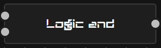
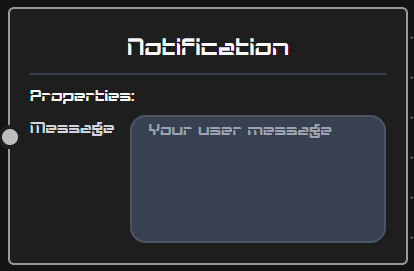

# Automation nodes

LoRaMation delivers basic set of functions for defining home automations. This page contains brief descriptions of each function (or node as they are called in the UI)
including their attributes like input/output and configurable parameters.

## Sensor

*Brief description*:
Sensor node provides sensor data from Zigbee devices. 

*Output*: Numeric/boolean value

*Parameters*:

- Device name: Zigbee devices' name as they appear in Zigbee2MQTT Zigbee bridge
- Attribute name: Device attribute, e.g. temperature.

## Logic AND

*Brief description*:
Logical AND function for boolean data.

*Inputs*: Boolean values
*Output*: Boolean value

## Logic OR

*Brief description*:
Logical OR function for boolean data.

*Inputs*: Boolean values
*Output*: Boolean value

## Timer switch

*Brief description*:
Switches a device on (e.g. light bulb) inside the start/stop time period. Otherwise, a switch off message is sent.

*Output*: Boolean value

*Parameters*:

- Start-time: Time (hh:mm) at which first "switch on" message is sent.
- Stop-time: Time (hh:mm) at which last "switch on" message is sent.

## Hysteresis

*Brief description*:
Hysteresis can be applied to regulate temperature/humidity etc.  The node takes a numeric sensor value (e.g. temperature) as input
and produces a boolean output to control a device (e.g. a heater). If a sensor value drops below min value treshold, a "switch on" message is sent towards a control device. Vice versa, a "switch off" message is sent after maximum threshold is reached.

*Input*: Numeric value
*Output*: Boolean value

*Parameters*:

- Min-value: Minimum threshold value (numeric float)
- Max-value: Maximum threshold value (numeric float)

## Countdown switch

*Brief description*:
Switches a device on (e.g. light bulb) for a period of time based on a binary input (e.g. motion sensor).

*Input*: Boolean value
*Output*: Boolean value

*Parameters*:

- Counter value: Seconds (integer value) to switch a device on.

## Notification

*Brief description*:
A user can set simple string notifications, which are sent as soon as a notification node receives input data.

*Input*: Any value

## Value filter

*Brief description*:
This node passes data based on a selected comparison operation. Example: If temperature input value is greater than a set value, the
input is forwarded to the output. 

*Input*: Boolean/numeric value
*Output*: Boolean/numeric value

*Brief description*:
Output node is a control input to binary Zigbee devices such as light bulbs. 

*Input*: Boolean value

*Parameters*:

- Device name: Zigbee devices' name as they appear in Zigbee2MQTT Zigbee bridge
- Attribute name: Device attribute, e.g. state.